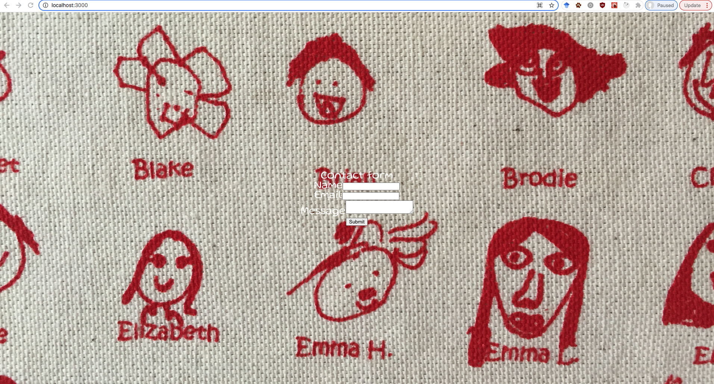

# :dolphin:Getting Started with Create React App
https://create-react-app.dev/docs/getting-started

### Sends email via Node.js
Joan followed this article https://github.com/w3collective/react-contact-form to test the send email via Node.js functionality. Google blocked my attempt to receive my own test email unless I turn on the "less secure app access" in my gmail account settings. 

### Introducing Google font family
Joan introduces google font family following this blog: https://blog.greenroots.info/3-quick-ways-to-add-fonts-to-your-react-app

### Introducing React Bootstrap
https://react-bootstrap.netlify.app/getting-started/introduction
### Current development

### Joan's wish list 
I wish one day our developers are able to color text in our readme file. It will be handy for the developers to dress up readme and demo their projects to the clients. 
https://github.com/github/markup/issues/369
